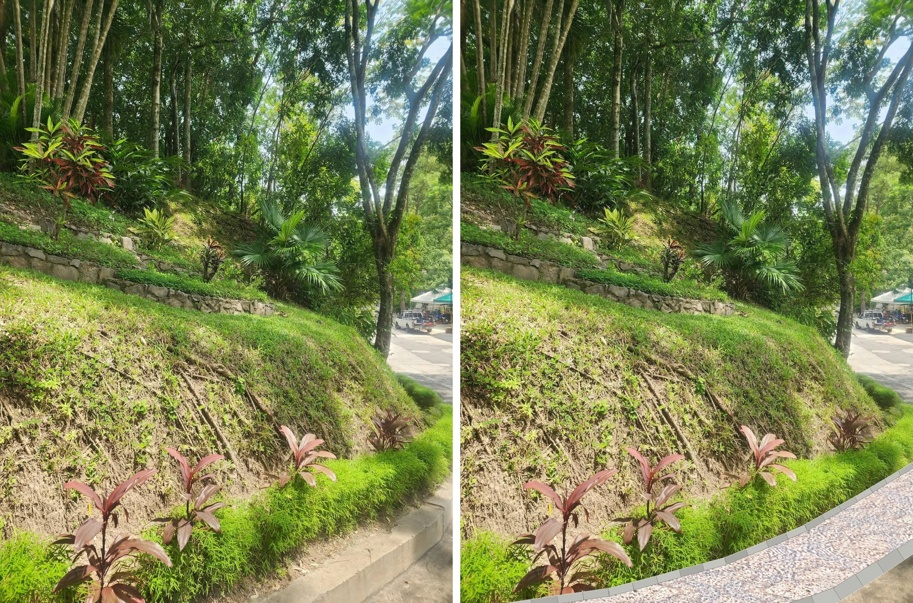

# Caminho de pedrisco branco (1 m) com meio-fio de paver



Caminho de **1,00 m de largura total**, no lugar da faixa de grama e do meio-fio de
concreto atuais, ao pé do talude. Acabamento em **pedrisco branco** (no padrão da imagem de referência
`referencia_pedrisco_branco.jpg`), contido por uma linha de
paver em pé de cada lado: em **cinza-claro**: um lado contra o talude e o outro
substituindo o meio-fio junto à rua. A faixa de grama e as dracenas ficam onde estão.

## Corte transversal

```
 talude │                    1,00 m                       │ rua
        ┌─┐                                             ┌─┐
        │P│  pedrisco 4–5 cm                            │P│   P = paver 20×10×8 em pé,
        │ │░░░░░░░░░░░░░░░░░░░░░░░░░░░░░░░░░░░░░░░░░░░░░│ │       2 cm acima do pedrisco
        │ │▓▓▓▓▓▓▓▓ brita graduada 7 cm (compactada) ▓▓▓│ │
        └┬┘~~~~~~~~~~~~ manta geotêxtil ~~~~~~~~~~~~~~~~└┬┘
     concreto                solo compactado        concreto
     de fixação                                     de fixação
        ← 8 →├────────────── 0,84 m ─────────────────┤← 8 →
```

- Caimento transversal de **~2 % em direção à rua**, para escoar a água que desce do talude.
- Os pavers ficam **2 cm acima** do pedrisco, para segurar a pedra.

## Execução

1. Retirar o meio-fio de concreto e só a parte da faixa de grama que fica dentro
   do 1,00 m do caminho, preservando as dracenas (*Cordyline*).
2. Escavar uns 15 cm e compactar o solo com placa vibratória ou soquete.
3. Abrir uma vala de cada lado e assentar os pavers em pé sobre concreto
   (traço 1:3:4), com reforço de concreto pelo lado de fora. Conferir o
   alinhamento com linha esticada e o nível com mangueira.
4. Estender a manta geotêxtil (bidim) entre as linhas de paver. Ela evita mato e
   impede que o pedrisco afunde no solo.
5. Espalhar 7 cm de brita graduada (bica corrida), molhar e compactar.
6. Espalhar 4–5 cm de pedrisco e passar a placa vibratória uma vez, de leve.

## Materiais por metro linear de caminho

| Item | Quantidade/m | Observação |
|---|---|---|
| Paver 20×10×8 cm cinza-claro | 10 un | 5 por lado (+5 % de quebra) |
| Concreto de fixação dos pavers | 0,03 m³ | ~0,015 m³ por lado |
| Manta geotêxtil (bidim RT-10 ou similar) | 1,0 m² | |
| Brita graduada / bica corrida | 0,07 m³ | +20 % de compactação → ~0,085 m³ |
| Pedrisco branco (mármore ou dolomita britada, 4,8–9,5 mm) | 0,045 m³ | ≈ 70 kg |
| Escavação / bota-fora | 0,15 m³ | |

Para chegar ao total da obra, é só multiplicar pelo comprimento. Exemplo com **20 m**:
200 pavers, 0,6 m³ de concreto, 20 m² de manta, 1,7 m³ de brita graduada,
0,9 m³ de pedrisco branco (≈1,4 t).

## Cuidados

- **Do lado da rua, o meio-fio de paver não aguenta impacto de roda.** Se carros
  encostarem ali, troque esse lado por uma guia pré-moldada de concreto, na cor do
  paver, ou reforce o concreto de fixação.
- **Inclinação:** se o caminho tiver mais de ~5 % de declive no sentido do
  comprimento, o pedrisco tende a escorrer. Nesse caso, use grelha estabilizadora
  (colmeia plástica) sob o pedrisco ou faça travessas de paver a cada 2–3 m.
- **Pedrisco branco:** prefira mármore ou dolomita britados (angulares), que travam
  melhor do que seixo rolado. O branco mostra terra e folhas, então vale passar o
  soprador ou o rastelo com frequência e fazer uma reposição leve uma vez por ano.
- **Água do talude:** se escorre muita terra na chuva, vale fazer uma canaleta ou
  um dreno raso junto à linha de paver do lado do talude.

> A imagem é uma simulação esquemática, gerada por `gerar_simulacao.py`; as
> proporções são aproximadas.
